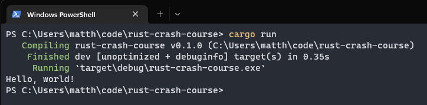

# First Steps

To get started, open a terminal and run the following command.

```bash
cargo new rust-crash-course
cd rust-crust-crash-course
```

This uses a package manager for rust named `cargo` to generate a minimal rust project for us.

Now, we can run the project with cargo.

```bash
cargo run
```

You should see the phrase `Hello, World!` printed in the terminal.

